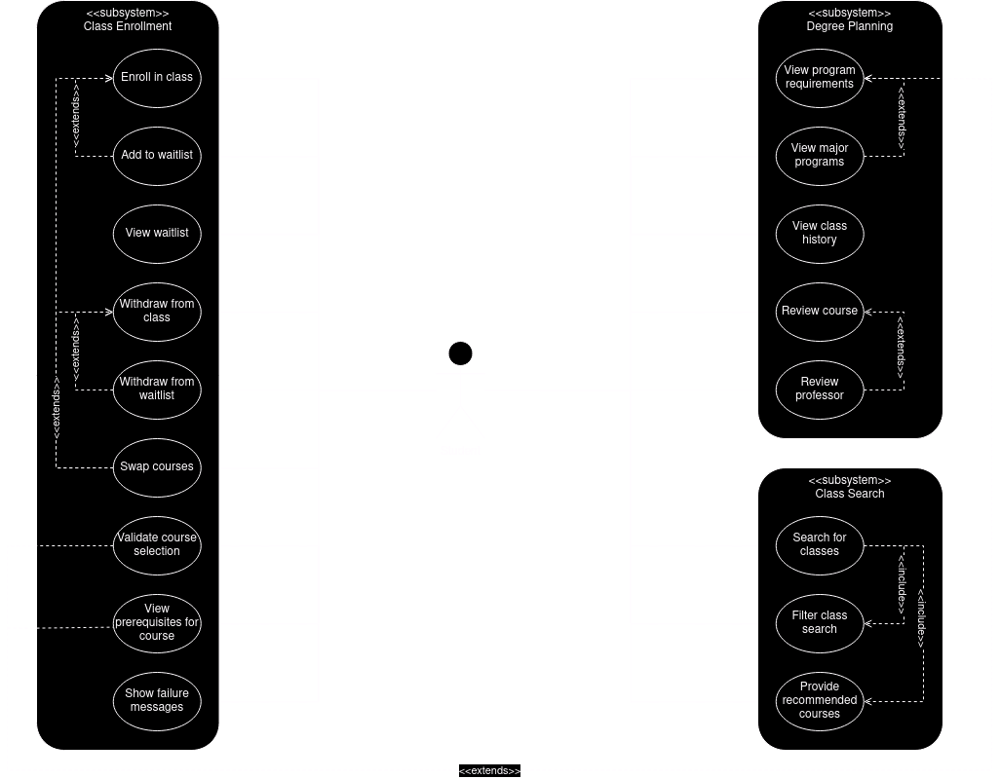
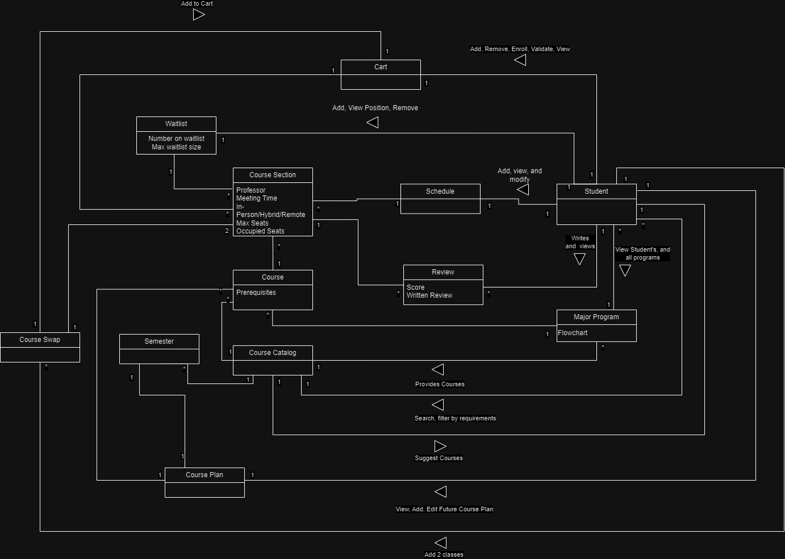
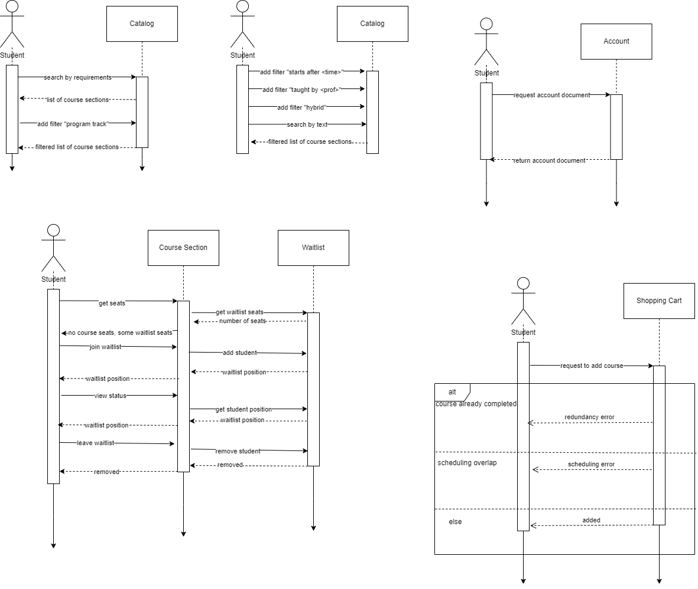

# SIS++ Class Selection System Design Documentation

## Team Information

-   Team name: TEAMNAME
-   Team members
    -   Daniel Arcega
    -   Dan Corcoran
    -   Reid Taylor
    -   Ryan Yocum

## Executive Summary

RIT's SIS (Student Information System) has a reputation among students and staff alike of being slow, clunky, and confusing. It has a large range of uses, including enrolling in courses, viewing grades, tracking program progress, and managing personal information. The scope of the system as a whole is too large for a team of four to tackle in a few months, so we have selected course enrollment and related activities to focus on, as it is the most common reason students find themselves using this software.

Our main goals are to streamline the current workflow for enrollment by providing relevant information in a clear way, and minimizing the number of actions needed to a few intuitive steps. We plan to introduce features that directly connect the program requirements and progress to the enrollment system as well as enabling students to make more informed choices about the courses the enroll in.

## Requirements

This section describes the features of the application.

### Definition of MVP

The following is a list of features that we consider to be critical in overhauling the course selection system. We will focus primarily on providing additional information and search filtering capability, as well as quality of life improvements. Beyond this, we will integrate expanded functionality for course swaps and waitlists, as well as future course planning.

### **MVP Features**

#### **Must include**

1. Students can search the course catalog based on their own required classes.  
	a. The course search page should include filter options for users’ program requirements (Gen ed, program core requirements, minor, immersion, etc.)  
	b. Course entries in the search page should show which of a student’s requirements they fulfill, if any.  
2. Students can view a flow diagram of their program requirements.  
	a. The course search page should include a link to a flow diagram of the student’s current program.  
3. Students can view the full chain of prerequisites for a course.  
	a. The simplified/list view of a course includes an indicator for unmet prerequisites  
	b. The detailed view of a course includes the the full tree of prerequisite courses that are required before enrolling  
	c. The prerequisite tree shows which prerequisites the student has met and highlights the next prerequisites the student can enroll in  
4. Students can filter their search by fields including but not limited to professor, time slot, remote/hybrid/in-person.  
	a. The course search page should include a drop list to filter by professor.  
	b. The course search page should include a time range field to filter classes that fit within a specified time period  
	c. The course search page should include a multi-select list to filter for remote, hybrid, and in-person classes  
5. Students can place themselves on a waitlist, view their position, and remove themselves from the waitlist.  
	a. Both the simplified/list view and detailed view of a course section should show the number of students enrolled and the number of students in the waitlist  
	b. When no seat is available but the student has met all requirements, a “Join waitlist” button should be displayed instead of “Add to cart”  
	c. A student’s cart should include waitlisted courses but clearly marks them as being waitlisted  
	d. Students should have a more detailed waitlist view that includes the option to leave the waitlist  
6. Courses are pre-validated with a student's completed courses and their current cart to avoid needing to manually validate after adding.  
	a. When a student attempts to add a course section to their cart, the program will check the student’s completed courses for repetition.  
	b. When a student attempts to add a course section to their cart, the program will check the student’s cart for overlapping sections or overlapping requirements.  
	c. Program will warn the student of course incompatibility, but not prevent them from adding it (?)  
7. Students can view their current cart in the form of a weekly schedule.  
	a. When viewing their cart, the student can select an option to view a weekly schedule of the courses.  
	b. The weekly schedule shows all days from Sunday to Saturday, with courses aligned on them ordered based on their start times.

---

#### **Should include**

8. Students can view other major's program plans.  
	a. The flow diagram page should have an option to view the flowcharts of other programs aside from the student’s one  
	b. The student’s flowchart should be the default  
9. Students can form "Course Swap Groups" that allow their cart to be dynamic and respond to availabilities according to the student's preferences.  
	a. Swap groups should contain an ordered list of course sections that the student has met all requirements for  
	b. A student’s swap groups should appear in their cart in the same way that a single course would  
	c. Swap groups in the cart should appear similar to individual courses, but be marked as a swap group and include an “expand” or “view detail” button  
	d. Both the simplified/list view and detailed view of a course should include a button “Add to swap group”  
	e. The “Add to swap group” button should open a dialog that allows the student to choose an existing swap group or create a new one  
	f. Existing swap groups in any view, including the “Add” dialog, should allow the order of courses in the group to be changed.  
	g. Existing swap groups in any view, including the “Add” dialog, should allow the courses in the group to be removed  
10. Students can select tentative courses for their future semesters and plan out their full degree.  
	a. Views of courses (e.g. headers for all sections of a course) should include a button or context menu option to add to plan  
	b. Clicking the button or option mentioned in criterion 10a should open a list allowing the student to select a semester to add the course to  
	c. A student’s navigation menu should include a “Long-term planning” tab that brings them to a corresponding page  
	d. The “Long-term planning” page should show sequential semesters as lists of courses  
	e. Courses listed under future semesters could be draggable between semester lists  
	f. The “Long-term planning” page should include an option to toggle showing prerequisite lines between courses  
11. Students can view the courses they took in previous semesters.  
	a. The “Long-term planning” page mentioned in feature 10 should include past and current semesters in addition to future, though not mutable.

---

#### **Could include**

12. Students can leave reviews on courses and professors, and can view other students' reviews.  
	a. On a course’s summary page, there is an area to leave a score and written review of that course.  
	b. On a professor’s summary page, a student can leave a score and written review of a professor.  
	c. Reviews should include an integer score in the range of \[1, 5\]  
	d. The average review score can be viewed on the summary page of the course or professor.  
	e. A course or professor summary page should have a tab where students can read all(?) written reviews of the course.  
	f. A student can only leave a review if they have had that course/professor before (?)  
13. SIS++ can offer recommendations for courses to enroll in based on a student's requirements and past courses.  
	a. The course search page should include a section that displays a small number of courses that are deemed relevant to a student.  
	b. The courses that appear in the recommendation section should be selected algorithmically based on factors that may include but are not limited to:  
		   - Next available program requirements  
		     - Courses that are similar in topic or follow in sequence from non-major courses the student has taken in the past  
		     - Courses taught by professors that the student has rated highly  
		     - Courses the student has added to their long-term-plan (feature 10\)  
	c. The recommendation section should be able to be hidden by the student.  
14. SIS++ displays clear and helpful messages when an action fails (such as enrolling in a course that is not available to them).  
	    a. When the student attempts to enroll from their cart and one or more courses do not have seats available, they should be informed as such, in detail  
	    b. Messages generated as a result of criterion 14a should include quick actions including enrolling in a different section (assuming no conflict and open seats) or joining the waitlist  
	    c. When the student attempts to enroll from their cart and one or more courses have unmet prerequisites, they should be informed as such, in detail  
	    d. Messages generated as a result of criterion 14c should include quick actions including enrolling in available prerequisite sections and adding the prerequisite sequence (if longer than one course) to their long-term plan (feature 10)

## Architecture and Design

This section describes the application architecture.

### Software Architecture

> _Place a architectural diagram here._ > _Describe your software architecture._

### Use Cases

The SIS++ MVP requires only one actor, the student. This student can interact with our three key subsystems: class searching, class enrollment, and degree planning. These three subsystems support all the most important features of the current SIS, while also providing more insight into the student's academic career. By improving visibility into a student's academics, they are able to more efficiently and more comfortably enroll in classes that will have a much higher likelihood of being applicable to their degrees. By also including degree planning, SIS++ elimintates the tedious task of visiting multiple different RIT webpages and endlessly scanning program information in the hopes that you are enrolling in the correct classes. These use cases reduce workload and stress for students and advisors alike.

### Domain Model

### Sequence Diagram

### Class Diagram

> _Place a class diagram here._ > _Describe your class diagram._
